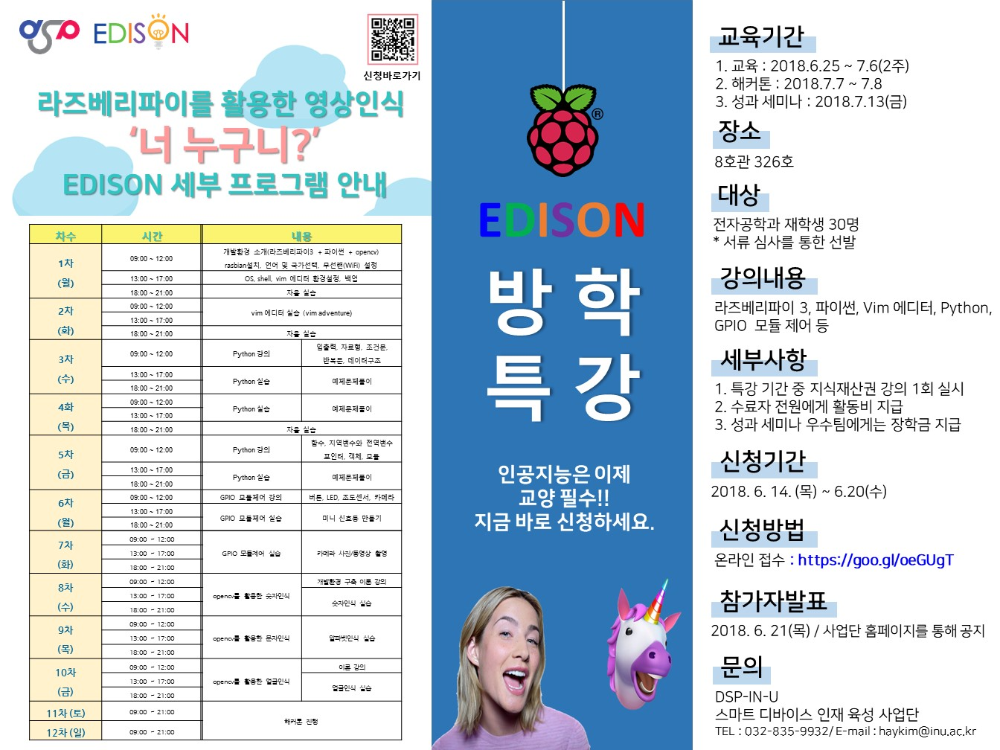

# Edison2018
한층 업그레이드 된 Edison 집중 교육 프로그램!

[프로그램 소개](OpeningEdison2018.pdf)

[경과 보고](Edison2018_경과보고.pdf)

## 팀별 프로젝트 소개 
* 1조 (김예지, 홍인화, 우진혁) [영상인식 기반 스마트 휠체어](https://github.com/honginhwa/ghddlsghk3)
* 하나로 (이찬희, 신지훈, 김태현) [이미지를 통한 차량사고 감지 및 자동 신고](https://github.com/Kim-Taehyeon/Car_Accident_Detection_System)
* 동서가구 (이장희, 김진호, 이규승) [헬로파이(스마트 스탠드)](https://github.com/kimjinho1/EDISON2018-smart-stand)
* 우주 (곽우정, 박주영) - [얼굴인식 도어락](www.github.com/jooyoung0525)
* 원피스 (임유환, 김동환, 함근상) [스마트 힐링 홈 (감정인식 홈 시스템 제어)](https://github.com/sanana4/2018-EDISON-Team-ONEPIECE)
* Grape (박준영, 신나라, 이종길) [해리포터와 재활치료](https://github.com/zoonyoung/Home-rehabilitation-treatment)
[TO BE UPDATED]

## 평가 방법

평가 요소 | 배점 | 평가 주안점 | 비고
-----|-----| ----- | -----
성실성 | 20 | 프로그램 전 과정을 성실하게 참석했는가? | 출석 및 참여도
창의성 | 20 | 일상 생활에서 흔히 마주치는 문제를 새로운 시각에서 바라보며 새로운 문제로 발굴하였는가? 문제 해결 과정에서 창의적인 방법들을 시도하였는가?  |  교육 과정 중 평가
공유 | 20 | 지식을 잘 정리하여 공유하는가?  | 협업, 참여, 보고서
완성도 | 20 | 제한된 시간을 효과적으로 활용하여 최선의 결과물을 도출하였는가? | 성과 발표시 평가
발표 | 20 | 핵심 내용을 놓지지 않고 효과적으로 전달하는가? 프로젝트에 대한 열정을 보여주는가?  | 성과 발표시 평가

## 보고서 작성 방법
### 온라인 소개자료
* 조별 프로젝트에 대한 상세 내용을 소개하는 github repository 를 작성하여 주소를 제출 (yyoo@inu.ac.kr)
* 기한: 2017년 7월 12일 자정
* 참고자료: 
   * [캡스톤 디자인 2018-1 repository](http://github.com/ys7yoo/CapstoneDesign_2018-1)에 있는 다양한 프로젝트들을 정리한 자료 참고
   * [Markdown 작성법](https://github.com/adam-p/markdown-here/wiki/Markdown-Cheatsheet) - README.md 작성시 참고
* 동영상 제작하여 링크 추가하면 보너스 점수!

### 결과 보고서
* 모든 프로그램 종료 후 결과 보고서 작성하여 사업단으로 제출
* 양식 및 기한 추후 공지

